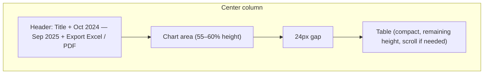

# Cash Evolution Section Reorganization

## Current state

- **File:** [frontend/app/app/dashboard/page.tsx](frontend/app/app/dashboard/page.tsx)
- Center column (lines ~618–719): header (title + Export to Excel/PDF), then chart (`flex-1 min-h-[340px]`), then table (`shrink-0`). Chart currently takes all remaining vertical space; table only as much as its content.
- Table: 8 category rows + total row, 12 months, `text-xs`, `p-3` cells, row hover (neon green) and portal tooltip with Mustashar insight already implemented.
- Mock data and categories (Sales, Loans, Other Inflow, Funding round, Short-term deposits, Other investment, Uncategorized, Internal transfers) and percentages on key rows already come from `buildCategoryTableRows` / `buildCashEvolutionData`.

## Target layout

## Implementation steps

### 1. Chart vs table height split (55–60% chart)

- In the center column, keep the existing header block unchanged (title, date subtitle, Export buttons).
- Replace the current two blocks (chart div + table div) with a **single flex container** that divides space by ratio:
  - **Chart wrapper:** `flex: 0 0 58%` (or `min-height: 58%` via a wrapper with explicit height), `min-h-[300px]` so it doesn’t collapse on small viewports, `overflow-auto` only if needed for very small height.
  - **Table wrapper:** `flex: 1 1 0`, `min-h-0`, `overflow-auto` so the table scrolls when space is limited and doesn’t force the chart to shrink.
- Use a **24px gap** between chart and table: e.g. add `gap-6` (24px) to that flex container, or `pt-6` on the table wrapper so there is exactly 24px between chart and table.
- Keep existing horizontal padding on chart and table (`px-4 md:px-5`) for alignment with the header.

**Concrete change:** Wrap the chart and table in one flex column with `flex flex-col gap-6` (or equivalent 24px). Give the chart’s parent `style={{ flex: '0 0 58%' }}` and `minHeight: 300` (or Tailwind `min-h-[300px]`), and the table’s parent `flex-1 min-h-0 overflow-auto`. Ensure the outer center column remains `flex flex-col overflow-hidden` so the flex children get a defined height.

### 2. Table: compact and readable

- **Smaller font / tighter rows:** Change table from `text-xs` to `text-[11px]` (or keep `text-xs` and only tighten padding). Change cell padding from `p-3` to `py-2 px-3` (or `py-2 px-2.5`) for header and body cells so rows are tighter.
- **Content:** Keep the full monthly breakdown and all 8 categories; no change to `buildCategoryTableRows` or mock data. Percentages on main rows are already present (e.g. Sales, Loans); leave as is.
- Keep sticky first column, total row styling (`border-t-2`, `bg-muted/30`), and RTL/locale handling.

### 3. Spacing and balance

- Apply the 24px gap only between chart and table (as above); do not add extra margin above/below the whole Cash Evolution block unless the current page padding is changed.
- Remove or reduce any redundant padding that creates “stretched” whitespace: e.g. keep chart container padding as `px-4 md:px-5 pt-4 pb-4` but ensure the table container uses `px-4 md:px-5 py-3` and that the 24px gap is the only large vertical space between chart and table.
- Ensure the center column does not use negative margins or overflow that would cause the right sidebar to overlap; keep `min-w-0` and `overflow-hidden` on the center column so the sidebar layout stays intact.

### 4. Preserve existing behavior

- **Export buttons:** No change to position, labels, or handlers (Excel green, PDF primary).
- **Row hover:** Keep `motion.tr`, `whileHover={{ backgroundColor: "rgb(16 185 129 / 0.12)" }}`, and the existing portal tooltip (dark glassmorphism, Mustashar insight, category name, period, row total, % contribution). No change to tooltip content or styling.
- **Theme / RTL / font:** No changes; keep light theme, Arabic RTL, and Cairo as per app globals.

## Files to touch

| File                                                                       | Changes                                                                                                                                                                                                                                                                                           |
| -------------------------------------------------------------------------- | ------------------------------------------------------------------------------------------------------------------------------------------------------------------------------------------------------------------------------------------------------------------------------------------------- |
| [frontend/app/app/dashboard/page.tsx](frontend/app/app/dashboard/page.tsx) | (1) Wrap chart + table in one flex container with 24px gap and chart 58% / table flex-1 min-h-0. (2) Table: reduce cell padding to `py-2 px-3` (and header same), optionally `text-[11px]`. No changes to `buildCategoryTableRows`, `buildCashEvolutionData`, export handlers, or tooltip portal. |

## Summary

- One layout change: chart gets a fixed share of height (~58%), table gets the rest and scrolls.
- One spacing change: 24px between chart and table.
- One table tweak: tighter rows (smaller vertical padding, optionally slightly smaller font).
- Everything else (export buttons, hover, tooltip, mock data, categories, RTL, theme) stays as is.

