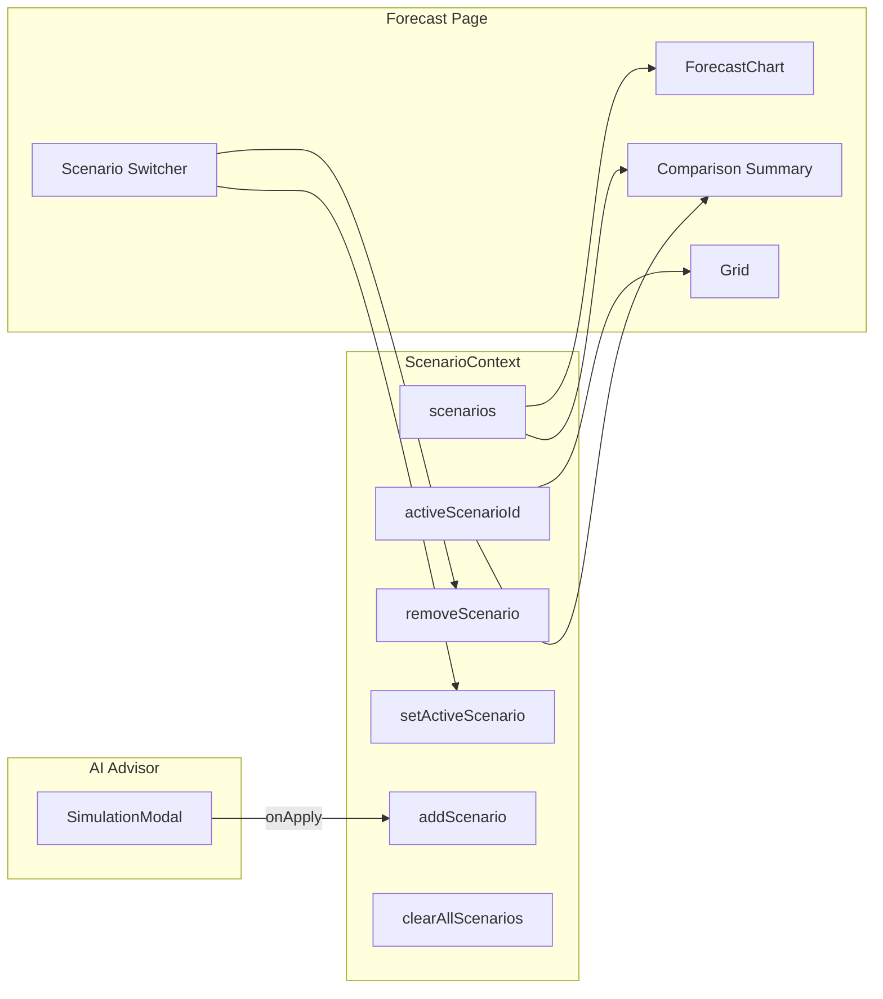

# Multi-Scenario Mode Upgrade

## Scope and constraints

- **In scope:** [ScenarioContext](frontend/contexts/ScenarioContext.tsx), AI Advisor apply flow, [ForecastChart](frontend/features/forecast/forecast-chart.tsx), Forecast page (switcher + summary card). Local state only; no API or DB.
- **Out of scope:** Dashboard; no refactor of the rest of the app. Scenario-planner is only adjusted to pass the new chart props (base + scenarios); no other logic changes there.
- **Preserve:** Base forecast and existing monthly MasterForecastChart + grid on Forecast page.

---

## 1. Update ScenarioContext

**File:** [frontend/contexts/ScenarioContext.tsx](frontend/contexts/ScenarioContext.tsx)

- **State:** Replace `activeScenario: Scenario | null` with:
  - `scenarios: Scenario[]` (max length 3)
  - `activeScenarioId: string | null` (primary comparison / “selected” scenario)
- **API:** Replace `setScenario` / `resetScenario` with:
  - `addScenario(scenario: Scenario)`: append if `scenarios.length < 3`, otherwise ignore or replace (e.g. replace oldest or show toast “max 3”).
  - `removeScenario(id: string)`: filter out by id; clear `activeScenarioId` if it was that id.
  - `setActiveScenario(id: string | null)`: set `activeScenarioId`.
  - `clearAllScenarios()`: set `scenarios = []` and `activeScenarioId = null`.
- **Derived:** Expose `activeScenario: Scenario | null` as the scenario whose `id === activeScenarioId` (for backward compatibility where needed, e.g. grid delta on Forecast page).
- Keep existing `Scenario` interface unchanged (`id`, `type`, `deltaCash`, `newForecast`, `riskLevel`, `confidence`).

---

## 2. Update simulation apply logic (AI Advisor)

**File:** [frontend/app/app/ai-advisor/page.tsx](frontend/app/app/ai-advisor/page.tsx)

- Replace `setScenario(scenario)` with `addScenario(scenario)` (from `useScenario()`).
- If at max (3), either: do not add and toast “Maximum 3 scenarios”, or add and remove oldest; choose one and stick to it.
- Optional: after add, call `setActiveScenario(scenario.id)` so the new scenario is primary.
- Keep the existing “applied scenario” banner behavior but drive it from the new context (e.g. show primary scenario or list of scenario count). Prefer minimal change: e.g. show “X scenario(s) active” and/or primary scenario summary.

---

## 3. Update ForecastChart

**File:** [frontend/features/forecast/forecast-chart.tsx](frontend/features/forecast/forecast-chart.tsx)

- **New props (primary API):**
  - `base: number[]` — base forecast values (e.g. 7 or 60 points).
  - `scenarios: Scenario[]` — list of scenarios (each has `newForecast: number[]`).
  - `labels: string[]` — same length as `base`, for X-axis (e.g. `["Day 1", "Day 2", ...]` or week labels).
  - Keep `fmt`, `fmtAxis`, `isAr`, `currencyCode` as needed.
- **Data shape:** Build chart data array: `labels.map((label, i) => ({ label, baseBalance: base[i], ...scenarios.reduce((acc, s, j) => ({ ...acc, [`scenario_${s.id}`]: s.newForecast[i] }), {}) }))`.
- **Rendering:**
  - One **solid** line for base (`baseBalance`), same style as current “Base”.
  - One **dashed** line per scenario (`scenario_<id>`), each with a distinct color (e.g. palette: indigo, violet, amber or similar), same length as `base`.
  - **Dynamic legend:** Base + each scenario with a readable name (e.g. “Scenario A” / “السيناريو أ” by index, or type-based label). Use Recharts `Legend` and consistent names for each series.
- **Backward compatibility for scenario-planner:** Either:
  - **Option A:** Keep optional `data?: SimulatedDay[]`; when `data` is provided, use it and ignore `base`/`scenarios` (render base + single “scenario” line as today). Scenario-planner keeps passing `data={simulated}`.
  - **Option B:** Remove `data` and always use `base` + `scenarios`. Scenario-planner derives `base = simulated.map(d => d.baseBalance)`, `scenarios = activeScenario ? [{ ...activeScenario, newForecast: simulated.map(d => d.simulatedBalance) }] : []`, `labels = simulated.map(d => d.label)` and passes those.

Recommend **Option B** for a single chart API; scenario-planner change is a small prop derivation.

- **Tooltip:** Extend to show base + all visible scenario values and deltas (or base vs “primary” scenario) so it stays readable.
- **Remove** the old “Scenario Active” summary block that showed a single scenario; comparison is handled by the new Summary Card on the page.

---

## 4. Scenario Switcher UI (Forecast page)

**File:** [frontend/app/app/forecast/page.tsx](frontend/app/app/forecast/page.tsx)

- Add a **Scenario Switcher** block **above** the (new) ForecastChart section (not above MasterForecastChart). Use local state only (no API).
- **Buttons / chips:** “Base” plus one per scenario: “Scenario A”, “Scenario B”, “Scenario C” (or “السيناريو أ” etc. for AR). Order matches `scenarios` array.
- **Actions per scenario (and Base):**
  - **Toggle visibility:** Show/hide that series in the chart. Hold visibility in local state (e.g. `visibleIds: Set<string>` for scenario ids; “Base” always visible or separate flag).
  - **Delete:** Call `removeScenario(id)`; only for scenarios, not Base.
  - **Set as primary comparison:** Call `setActiveScenario(id)` (or `null` for Base). Use this for grid delta and any “primary” comparison in the summary.
- Pass visibility and scenario list into ForecastChart so it only renders lines for visible series. Keep “Base” always visible in the chart.

---

## 5. Comparison Summary Card (Forecast page)

**File:** [frontend/app/app/forecast/page.tsx](frontend/app/app/forecast/page.tsx)

- Add a **Comparison Summary** section (card or strip) that lists each scenario with:
  - **Delta Cash** — `scenario.deltaCash`
  - **Worst Week Cash** — `Math.min(...scenario.newForecast)`
  - **Risk Level** — `scenario.riskLevel`
  - **Confidence** — `scenario.confidence`
- One row or card per scenario; i18n for labels (AR/EN). Place near the Scenario Switcher or below the chart.
- Optional: visually highlight the “primary” scenario (where `scenario.id === activeScenarioId`).

---

## 6. Forecast page: wire base, chart, grid, and banner

**File:** [frontend/app/app/forecast/page.tsx](frontend/app/app/forecast/page.tsx)

- **Base series for ForecastChart:** Use a 7-day base consistent with the simulation engine (e.g. from [frontend/lib/simulationEngine.ts](frontend/lib/simulationEngine.ts) or a local constant like `originalForecast`). Generate `labels` (e.g. “Day 1”…“Day 7” or “W1”…“W7”).
- **Data flow:** `scenarios` and `activeScenarioId` from `useScenario()`. Visibility state for switcher kept in page state.
- **Where to add the new block:** Add a **new section** on the Forecast page that includes:
  1. Scenario Switcher (Base + Scenario A/B/C with visibility, delete, set primary).
  2. ForecastChart with `base`, `scenarios`, `labels`, and visibility so only visible series are drawn.
  3. Comparison Summary Card with Delta Cash, Worst Week Cash, Risk Level, Confidence per scenario.
- **Existing content:** Keep MasterForecastChart and the data grid. Continue to apply the **primary** scenario delta to the grid when `activeScenarioId` is set (using the scenario with that id from `scenarios`; same as current “activeScenario” delta logic). Replace the current single-scenario banner with a short “Primary: Scenario X” or “No primary scenario” and a “Clear all” that calls `clearAllScenarios()`.

---

## 7. Scenario-planner (minimal prop change)

**File:** [frontend/app/app/scenario-planner/page.tsx](frontend/app/app/scenario-planner/page.tsx)

- No change to sliders, params, or useForecastSimulation.
- When rendering ForecastChart, pass the **new** props: `base = simulated.map(d => d.baseBalance)`, `scenarios = activeScenario ? [{ ...activeScenario, newForecast: simulated.map(d => d.simulatedBalance) }] : []`, `labels = simulated.map(d => d.label)` (and `fmt`, `fmtAxis`, `isAr`, `currencyCode`). Remove passing `data` and `activeScenario` in the old shape so ForecastChart only uses the base + scenarios API.

---

## Implementation order

1. **ScenarioContext** — New state and API; keep `activeScenario` as derived for compatibility.
2. **AI Advisor** — Switch to `addScenario` and optional `setActiveScenario`; adjust banner.
3. **ForecastChart** — New props, build data from base + scenarios, multiple lines + dynamic legend; update tooltip.
4. **Forecast page** — Base series + labels; new section with Switcher, ForecastChart, Summary Card; wire visibility and primary to grid/banner.
5. **Scenario-planner** — Pass base + scenarios into ForecastChart.

---

## Data flow (high level)

---

## Files to touch (summary)

| File                                                                                           | Changes                                                                                                    |
| ---------------------------------------------------------------------------------------------- | ---------------------------------------------------------------------------------------------------------- |
| [frontend/contexts/ScenarioContext.tsx](frontend/contexts/ScenarioContext.tsx)                 | Multi-scenario state and API; max 3; derived activeScenario                                                |
| [frontend/app/app/ai-advisor/page.tsx](frontend/app/app/ai-advisor/page.tsx)                   | addScenario on apply; optional setActiveScenario; banner from context                                      |
| [frontend/features/forecast/forecast-chart.tsx](frontend/features/forecast/forecast-chart.tsx) | Props base + scenarios + labels; multi-line + legend; tooltip                                              |
| [frontend/app/app/forecast/page.tsx](frontend/app/app/forecast/page.tsx)                       | Base series; Switcher UI; ForecastChart section; Summary Card; grid from primary scenario; clearAll banner |
| [frontend/app/app/scenario-planner/page.tsx](frontend/app/app/scenario-planner/page.tsx)       | Pass base + scenarios + labels to ForecastChart (no logic change)                                          |

No new API routes, no DB, no dashboard edits.