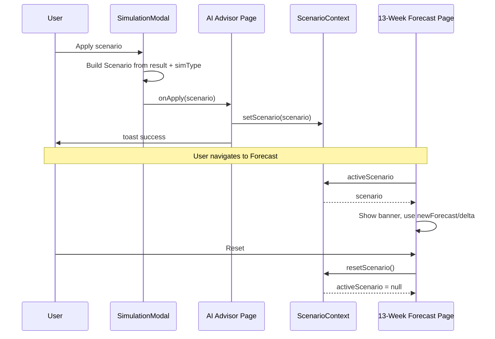

# Shared Scenario state via ScenarioContext

## Scope

- **In scope:** [frontend/contexts/ScenarioContext.tsx](frontend/contexts/ScenarioContext.tsx), [frontend/lib/providers.tsx](frontend/lib/providers.tsx), [frontend/app/app/ai-advisor/page.tsx](frontend/app/app/ai-advisor/page.tsx), [frontend/app/app/forecast/page.tsx](frontend/app/app/forecast/page.tsx), [frontend/components/agent/SimulationModal.tsx](frontend/components/agent/SimulationModal.tsx).
- **Out of scope:** Dashboard; any API or DB; existing forecast logic in scenario-planner or other pages (no changes to [frontend/features/forecast/use-forecast-simulation.ts](frontend/features/forecast/use-forecast-simulation.ts) or [frontend/app/app/scenario-planner/page.tsx](frontend/app/app/scenario-planner/page.tsx)).

## 1. Scenario type and context

**File:** [frontend/contexts/ScenarioContext.tsx](frontend/contexts/ScenarioContext.tsx) (new).

- **Scenario type** (exported):

```ts
export interface Scenario {
  id: string;
  type: "delay_payment" | "split_payment" | "accelerate_receivable";
  deltaCash: number;
  newForecast: number[];
  riskLevel: string;
  confidence: number;
}
```

- **Context value:** `activeScenario: Scenario | null`, `setScenario(scenario: Scenario | null): void`, `resetScenario(): void` (sets `activeScenario` to `null`).
- **State:** `useState<Scenario | null>(null)`.
- **Provider:** Wrap children with a single context provider; no persistence.

Pattern can mirror [frontend/contexts/CurrencyContext.tsx](frontend/contexts/CurrencyContext.tsx) (createContext + provider + `useScenario()` hook that throws if used outside provider).

## 2. Wrap app with ScenarioProvider

**File:** [frontend/lib/providers.tsx](frontend/lib/providers.tsx).

- Import `ScenarioProvider` from `@/contexts/ScenarioContext`.
- Wrap the tree with `<ScenarioProvider>` (e.g. next to `EntityProvider` / `ToastProvider` so both AI and Forecast pages are inside it). No change to dashboard-only branches.

## 3. AI Advisor page: set scenario on Apply

**File:** [frontend/app/app/ai-advisor/page.tsx](frontend/app/app/ai-advisor/page.tsx).

- Import `useScenario` from `@/contexts/ScenarioContext`.
- In `handleApplyScenario`, call `setScenario(scenario)` with the scenario object passed from the modal (see step 4). Keep existing success toast and optional local “applied” banner if desired; the source of truth for “active scenario” is context.
- **Optional:** Remove local `appliedForecast` state and rely only on context for the banner text, or keep a brief “just applied” message and read `activeScenario` for the banner so it stays in sync when reset from Forecast page.

## 4. SimulationModal: pass full Scenario to onApply

**File:** [frontend/components/agent/SimulationModal.tsx](frontend/components/agent/SimulationModal.tsx).

- Map modal’s `SimulationType` to context’s `Scenario.type`: `delay` → `delay_payment`, `split` → `split_payment`, `accelerate` → `accelerate_receivable`.
- When user clicks “Apply scenario”, build a `Scenario` object: `id: crypto.randomUUID()`, `type` from mapping, plus `deltaCash`, `newForecast`, `riskLevel`, `confidence` from current `result` (from [lib/simulationEngine.ts](frontend/lib/simulationEngine.ts) `SimulateResult`).
- Change `onApply` prop type from `(result: SimulateResult) => void` to `(scenario: Scenario) => void` and call `onApply(scenario)`.
- Import `Scenario` type from `@/contexts/ScenarioContext` (or a small shared types file if you prefer to avoid circular deps; context importing nothing from components is enough).

## 5. 13-Week Forecast page: read scenario, banner, and optional data adjustment

**File:** [frontend/app/app/forecast/page.tsx](frontend/app/app/forecast/page.tsx).

- Import `useScenario` from `@/contexts/ScenarioContext`.
- **Banner (required):** When `activeScenario` is non-null, render a banner above the main content (e.g. below filter bar) with:
  - Text: e.g. `Active Scenario: {type} (+{deltaCash} QAR)` (use existing `fmt`/currency from [CurrencyContext](frontend/contexts/CurrencyContext.tsx) for amount; type can be localized or shown as delay_payment / split_payment / accelerate_receivable).
  - **Reset** button that calls `resetScenario()`.
- **Use newForecast when scenario exists:** The page currently uses `getChartData(isAr)` and `getGridRows(isAr)` (monthly data). The scenario’s `newForecast` is 7 daily values. To “use newForecast instead of base forecast” without breaking existing logic:
  - **Option A (minimal):** When `activeScenario` is set, apply `activeScenario.deltaCash` to the first month’s closing balance (and optionally opening of next month) and propagate through existing chart/grid derivation so the monthly view reflects the scenario delta. Keep `getChartData` / `getGridRows` as the base; in the page component derive `chartData` and `gridRows` by adding the scenario delta to the first month’s balance and recalculating subsequent months from that (or add `deltaCash` to every closing balance for a simple shift). This preserves existing forecast structure.
  - **Option B:** Only show the banner and a small “7-day scenario” read-only block (e.g. list or mini bars of `newForecast`) and leave the main chart/grid unchanged.
- Recommend **Option A** so the 13-Week Forecast view visibly “uses” the scenario; implementation can be a helper that takes base chart data and `deltaCash` and returns adjusted data for the first month onward.

## 6. Data flow summary




## 7. Implementation order

1. Create **ScenarioContext** (type, context, provider, hook).
2. Add **ScenarioProvider** in **providers.tsx**.
3. Update **SimulationModal** to build and pass **Scenario** to **onApply**.
4. Update **AI Advisor page** to call **setScenario** in **onApply** (and use **useScenario** for any banner).
5. Update **13-Week Forecast page** to read **activeScenario**, show banner + Reset, and (Option A) derive chart/grid data using **deltaCash** when scenario is set.

## 8. Edge cases

- **Currency:** Banner on Forecast page should use the app currency (e.g. from `useCurrency()`) for the amount, not hardcode “QAR” if the app supports multiple currencies (current codebase uses `currCode` / `fmt`).
- **Type safety:** `riskLevel` in `Scenario` is `string` per your spec; keep consistency with `SimulateResult.riskLevel` (`"high" | "medium" | "low"`) when building the scenario in the modal.

